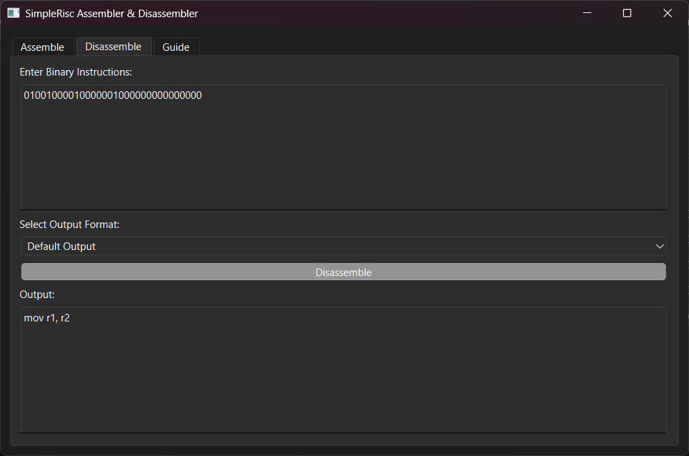
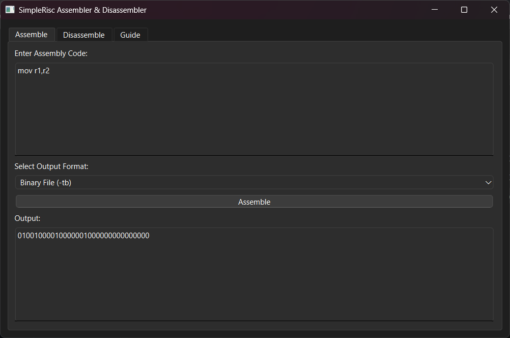

# 🤖 Welcome to SimpleRisc Robot!

Hello, SimpleRisc Robot! Our world is made of 0s and 1s, and unfortunately, we cannot talk to humans—yet! 😢 But don't worry, I am here to help me! Use `unassemble.py` to understand what the binary world is saying.

---

## 🚀 New! Download the SimpleRisc App (.exe)

No need to set up Python! You can now download and use **SimpleRisc** as a standalone application.

📥 **Download here:**  
🔗 [SimpleRisc App (Windows)](https://drive.google.com/file/d/1ofCs7vQzGzuKeRKPL3X3AkvzpzIW7E1v/view?usp=sharing)

---

## 🔄 Using the Disassembler (`unassemble.py`)

Have some binary code but don't know what it means? Use `unassemble.py` to convert it back into human-readable assembly!

### Usage:
```sh
python unassemble.py -f input.bin -o output.txt [-i]
```

### Options:
- `-h, --help` → Show help message.
- `-f, --file FILE` → Input file containing binary instructions.
- `-o, --output OUTPUT` → Output file to save the disassembled assembly.
- `-i, --include-binary` → Include binary instructions in the output for reference.

### 🔹 Example:
```sh
python unassemble.py -f machine_code.txt -o decoded.txt -i
```
### **App Version**  
1. Open the **SimpleRisc App**.
2. Go to the **Disassemble** tab.
3. Paste binary instructions and select the output format.
4. Click **Disassemble** to view the output.
---
🖼 **Example Screenshot:**  


---
## 🔍 Are You Human?
Oh... wait! You are not a robot? 🤖❌ Are you human?

Before we proceed, please verify that you're a human! 
<p align="center">
  <a href="https://www.youtube.com/watch?v=xvFZjo5PgG0" target="_blank">
  
</p>

---

## 🛠 Using the Assembler (`assemble.py`)

Want to talk to me 0s and 1s? Use `assemble.py` to convert human-readable assembly into machine code!

### Usage:
```sh
python assemble.py -f input.txt [options]
```

### Options:
- `-h, --help` → Show help message.
- `-f, --file FILE` → Assembly file to parse.
- `-t, --tokens` → Print tokenized instructions.
- `-e, --encode` → Print encoded instructions.
- `-b, --bin` → Generate binary output.
- `-hh, --hex` → Generate hex output.
- `-tb, --txtbin` → Save binary output to a text file.
- `-th, --txthex` → Save hex output to a text file.

### 🔹 Example:
```sh
python assemble.py -f program.txt -b
```
This command converts `program.txt` into binary machine code.

---
### **App Version**  
1. Open the **SimpleRisc App**.
2. Go to the **Assemble** tab.
3. Paste assembly code and choose the desired output format.
4. Click **Assemble** to generate the output.

🖼 **Example Screenshot:**  


---

## 📖 Online Documentation
Check out the full guide here: [SimpleRisc Documentation](https://puneethreddy592.github.io/assemble_unassemble/)

---
---

## 📂 Project Structure
```
── README.md        # 📖 Project Documentation
├── about.html       # 🌐 About SimpleRISC Page
├── assemble.py      # 🔄 Converts Assembly to Binary (New output modes)
├── guide.html       # 📚 Guide for Using the Tools
├── human.html       # 🤖 Instruction page
├── index.html       # 🏠 Main Landing Page
├── unassemble.py    # 🔄 Converts Binary to Assembly (New output mode)
├── verifcation.png
├── assemble.png     # 🖼 Example screenshot for Assemble tab
├── unassemble.png   # 🖼 Example screenshot for Disassemble tab
```

---

## 🌟 Features

✅ Convert Assembly to Binary  
✅ Convert Binary to Assembly  
✅ Tokenization & Instruction Encoding  
✅ Multiple Output Formats (Binary, Hex, Text)  
✅ Supports Labels & Immediate Values  
✅ **Standalone Windows App Available!**  

---
## ⚠️ Only Constraints
- The **assembly code** must follow the guidelines strictly.  
  🔗 [Check Guidelines here](https://puneethreddy592.github.io/assemble_unassemble/guide.html)  
- **Disassemble feature in the app is not fully tested yet.**  
  ⚠️ There might be some errors in disassembling output.  

## 🤝 Contributing

Want to help improve SimpleRisc Robot? Here’s how:

- 🛠 Report issues and suggest improvements.
- 🔥 Submit pull requests with new features.
- 📖 Improve documentation.
- ⭐ Give this repository a star if you like it! ⭐

🚀 Let's bridge the gap between humans and machines!
